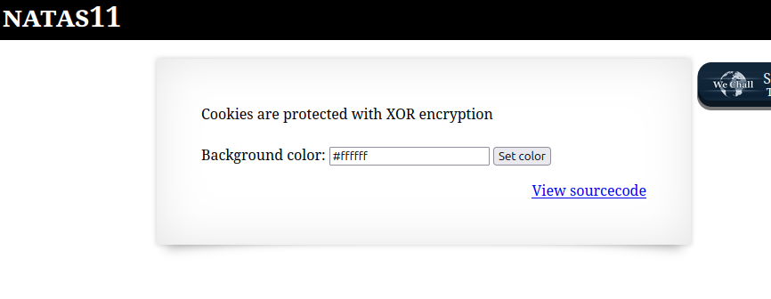
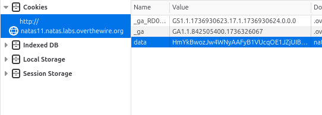
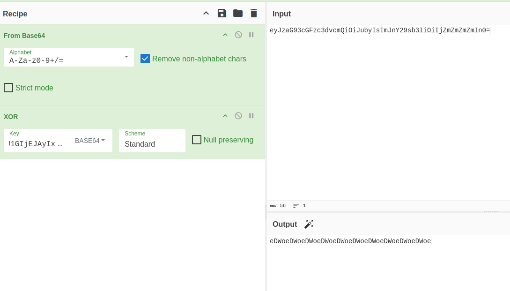

```

Natas Level 10 → Level 11

Username: natas11
URL:      http://natas11.natas.labs.overthewire.org
```

  


CookieがXORされているらしい。  

XORとは、  
> 論理演算の一つで、二つの命題のいずれか一方のみが真のときに真となり、両方真や両方偽のときは偽となるもの。

XORは、xorに使用された値が分からなければ復元できない。  

とりあえず、Cookieとソースコードを見てみる。  

Cookie  
  

Key: `data`  
Value: `HmYkBwozJw4WNyAAFyB1VUcqOE1JZjUIBis7ABdmbU1GIjEJVXRnTRg%3D`  


ソースコード  
```
<html>
<head>
<!-- This stuff in the header has nothing to do with the level -->
<link rel="stylesheet" type="text/css" href="http://natas.labs.overthewire.org/css/level.css">
<link rel="stylesheet" href="http://natas.labs.overthewire.org/css/jquery-ui.css" />
<link rel="stylesheet" href="http://natas.labs.overthewire.org/css/wechall.css" />
<script src="http://natas.labs.overthewire.org/js/jquery-1.9.1.js"></script>
<script src="http://natas.labs.overthewire.org/js/jquery-ui.js"></script>
<script src=http://natas.labs.overthewire.org/js/wechall-data.js></script><script src="http://natas.labs.overthewire.org/js/wechall.js"></script>
<script>var wechallinfo = { "level": "natas11", "pass": "<censored>" };</script></head>
<?

$defaultdata = array( "showpassword"=>"no", "bgcolor"=>"#ffffff");

function xor_encrypt($in) {
    $key = '<censored>';
    $text = $in;
    $outText = '';

    // Iterate through each character
    for($i=0;$i<strlen($text);$i++) {
    $outText .= $text[$i] ^ $key[$i % strlen($key)];
    }

    return $outText;
}

function loadData($def) {
    global $_COOKIE;
    $mydata = $def;
    if(array_key_exists("data", $_COOKIE)) {
    $tempdata = json_decode(xor_encrypt(base64_decode($_COOKIE["data"])), true);
    if(is_array($tempdata) && array_key_exists("showpassword", $tempdata) && array_key_exists("bgcolor", $tempdata)) {
        if (preg_match('/^#(?:[a-f\d]{6})$/i', $tempdata['bgcolor'])) {
        $mydata['showpassword'] = $tempdata['showpassword'];
        $mydata['bgcolor'] = $tempdata['bgcolor'];
        }
    }
    }
    return $mydata;
}

function saveData($d) {
    setcookie("data", base64_encode(xor_encrypt(json_encode($d))));
}

$data = loadData($defaultdata);

if(array_key_exists("bgcolor",$_REQUEST)) {
    if (preg_match('/^#(?:[a-f\d]{6})$/i', $_REQUEST['bgcolor'])) {
        $data['bgcolor'] = $_REQUEST['bgcolor'];
    }
}

saveData($data);


?>

<h1>natas11</h1>
<div id="content">
<body style="background: <?=$data['bgcolor']?>;">
Cookies are protected with XOR encryption<br/><br/>

<?
if($data["showpassword"] == "yes") {
    print "The password for natas12 is <censored><br>";
}

?>

<form>
Background color: <input name=bgcolor value="<?=$data['bgcolor']?>">
<input type=submit value="Set color">
</form>

<div id="viewsource"><a href="index-source.html">View sourcecode</a></div>
</div>
</body>
</html>
```

XOR暗号の欠陥として、"短い鍵"を使用していたり"平文の一部が推測可能"な場合に鍵が判明する。  
そしてXOR暗号の特徴として、暗号文と平文をXORするとkeyが求められる。  

とりあえず、$defaultdataをxor暗号を行う前のjson_encode()してbase64_encode()した値を取得する。  

  

`eyJzaG93cGFzc3dvcmQiOiJubyIsImJnY29sb3IiOiIjZmZmZmZmIn0=` となる。  

次に`array( "showpassword"=>"no", "bgcolor"=>"#ffffff");`をXOR暗号化後の値を容易する。  
`HmYkBwozJw4WNyAAFyB1VUcqOE1JZjUIBis7ABdmbU1GIjEJAyIxTRg%3D`となる。  
最後の`%3d`はイコール(=)をURLエンコードしたものである。  

そして、この二つの値同士でXORを行う。  
  


`eDWoeDWoeDWoeDWoeDWoeDWoeDWoeDWoeDWoeDWoe`と`eDWo`が繰り返されており`eDWo`がkeyであることがわかった。  

今回の問題では`showpassword`の値がyesだったらクリアみたいなので編集したcookieを作る。  

  


これをcookieにセットしてリロード。  

```
<html>
<head>
<!-- This stuff in the header has nothing to do with the level -->
<link rel="stylesheet" type="text/css" href="http://natas.labs.overthewire.org/css/level.css">
<link rel="stylesheet" href="http://natas.labs.overthewire.org/css/jquery-ui.css" />
<link rel="stylesheet" href="http://natas.labs.overthewire.org/css/wechall.css" />
<script src="http://natas.labs.overthewire.org/js/jquery-1.9.1.js"></script>
<script src="http://natas.labs.overthewire.org/js/jquery-ui.js"></script>
<script src=http://natas.labs.overthewire.org/js/wechall-data.js></script><script src="http://natas.labs.overthewire.org/js/wechall.js"></script>
<script>var wechallinfo = { "level": "natas11", "pass": "UJdqkK1pTu6VLt9UHWAgRZz6sVUZ3lEk" };</script></head>

<h1>natas11</h1>
<div id="content">
<body style="background: #ffffff;">
Cookies are protected with XOR encryption<br/><br/>

The password for natas12 is ******************************<br>
<form>
Background color: <input name=bgcolor value="#ffffff">
<input type=submit value="Set color">
</form>

<div id="viewsource"><a href="index-source.html">View sourcecode</a></div>
</div>
</body>
</html>
```


クリア


