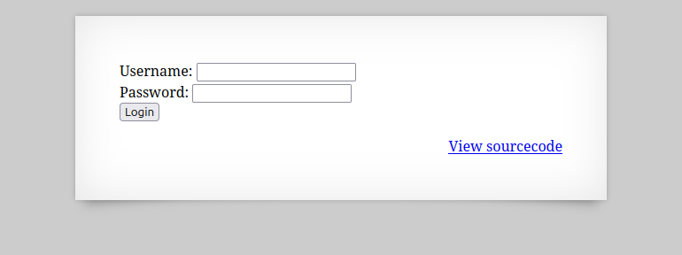
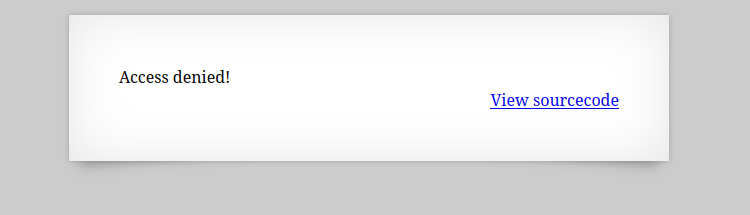
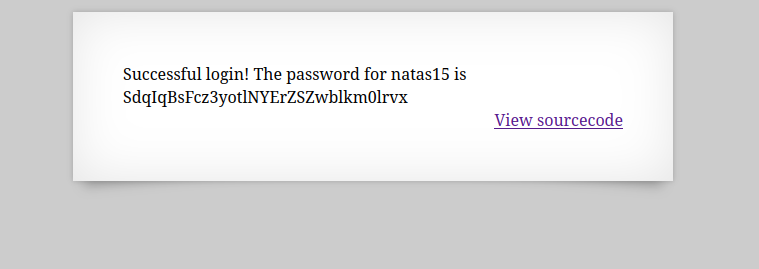

#  

usernameとpasswordを入力する画面がある。  

適当に入力すると" Access denied!"と表示される。  

#  

ソースコードを見てみる。  

```
 <html>
<head>
<!-- This stuff in the header has nothing to do with the level -->
<link rel="stylesheet" type="text/css" href="http://natas.labs.overthewire.org/css/level.css">
<link rel="stylesheet" href="http://natas.labs.overthewire.org/css/jquery-ui.css" />
<link rel="stylesheet" href="http://natas.labs.overthewire.org/css/wechall.css" />
<script src="http://natas.labs.overthewire.org/js/jquery-1.9.1.js"></script>
<script src="http://natas.labs.overthewire.org/js/jquery-ui.js"></script>
<script src=http://natas.labs.overthewire.org/js/wechall-data.js></script><script src="http://natas.labs.overthewire.org/js/wechall.js"></script>
<script>var wechallinfo = { "level": "natas14", "pass": "<censored>" };</script></head>
<body>
<h1>natas14</h1>
<div id="content">
<?php
if(array_key_exists("username", $_REQUEST)) {
    $link = mysqli_connect('localhost', 'natas14', '<censored>');
    mysqli_select_db($link, 'natas14');

    $query = "SELECT * from users where username=\"".$_REQUEST["username"]."\" and password=\"".$_REQUEST["password"]."\"";
    if(array_key_exists("debug", $_GET)) {
        echo "Executing query: $query<br>";
    }

    if(mysqli_num_rows(mysqli_query($link, $query)) > 0) {
            echo "Successful login! The password for natas15 is <censored><br>";
    } else {
            echo "Access denied!<br>";
    }
    mysqli_close($link);
} else {
?>

<form action="index.php" method="POST">
Username: <input name="username"><br>
Password: <input name="password"><br>
<input type="submit" value="Login" />
</form>
<?php } ?>
<div id="viewsource"><a href="index-source.html">View sourcecode</a></div>
</div>
</body>
</html>
```

初めに`array_key_exists`関数で 指定したキーまたは添字が配列にあるかどうかを調べられ、  
`mysql_connect`関数でMySQL サーバーへの接続を行う。  

DBへのクエリを見てみると、  
```
$query = "SELECT * from users where username=\"".$_REQUEST["username"]."\" and password=\"".$_REQUEST["password"]."\"";
```

とあり、クライアントからの文字列をエスケープ処理を行わず組んでいるためSQL Injectionが可能と予想する。  
クエリの結果セットが1つ以上返されたらflagが表示される感じ。  

usernameとpasswordはダブルクォートで囲まれるみたいなので、  
```
username: natas14
password: " or "1"="1
```
みたいなリクエストでtrueになり通れる。  

  


