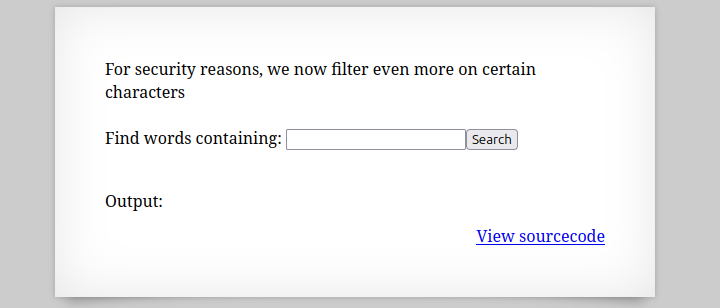
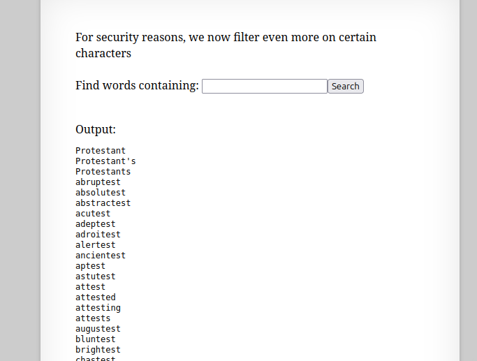

  

単語を検索することができるらしい。  


適当に"test"と検索すると色々出てきた。  

  

ソースコードを見てみる。  
```
 <html>
<head>
<!-- This stuff in the header has nothing to do with the level -->
<link rel="stylesheet" type="text/css" href="http://natas.labs.overthewire.org/css/level.css">
<link rel="stylesheet" href="http://natas.labs.overthewire.org/css/jquery-ui.css" />
<link rel="stylesheet" href="http://natas.labs.overthewire.org/css/wechall.css" />
<script src="http://natas.labs.overthewire.org/js/jquery-1.9.1.js"></script>
<script src="http://natas.labs.overthewire.org/js/jquery-ui.js"></script>
<script src=http://natas.labs.overthewire.org/js/wechall-data.js></script><script src="http://natas.labs.overthewire.org/js/wechall.js"></script>
<script>var wechallinfo = { "level": "natas16", "pass": "<censored>" };</script></head>
<body>
<h1>natas16</h1>
<div id="content">

For security reasons, we now filter even more on certain characters<br/><br/>
<form>
Find words containing: <input name=needle><input type=submit name=submit value=Search><br><br>
</form>


Output:
<pre>
<?
$key = "";

if(array_key_exists("needle", $_REQUEST)) {
    $key = $_REQUEST["needle"];
}

if($key != "") {
    if(preg_match('/[;|&`\'"]/',$key)) {
        print "Input contains an illegal character!";
    } else {
        passthru("grep -i \"$key\" dictionary.txt");
    }
}
?>
</pre>

<div id="viewsource"><a href="index-source.html">View sourcecode</a></div>
</div>
</body>
</html>
```

中で`dictionary.txt`からgrepコマンドで検索をしているみたい。  
OSコマンドインジェクション問題だと予想する。  

preg_match関数で不正だと認識する文字を調べていて、以下の記号が使えない。  
```
;|&`\'"
```

結論から言うと$keyに、  
```
$(grep " + c + " /etc/natas_webpass/natas17)<末尾文字列>
```

のようにgrepコマンドで有効な文字列を探して次に、  
```
$(grep " + password + c + " /etc/natas_webpass/natas17)<末尾文字列>
```
のように有効な文字列から文字の順番を確定させるという解き方でした。  

grepコマンドは以下のような空文字だと全ての辞書が返されます。  
```
grep -i "" dictionary.txt
```

もし`/etc/natas_webpass/natas17`から有効な文字が発見されたらあのflagの文字列は`dictionary.txt`には含まれないようなランダムな文字列なので、  
`passthru("grep -i \"$key\" dictionary.txt");`の結果は何も返されないことになります。  
この性質を利用して解いていきます。  


