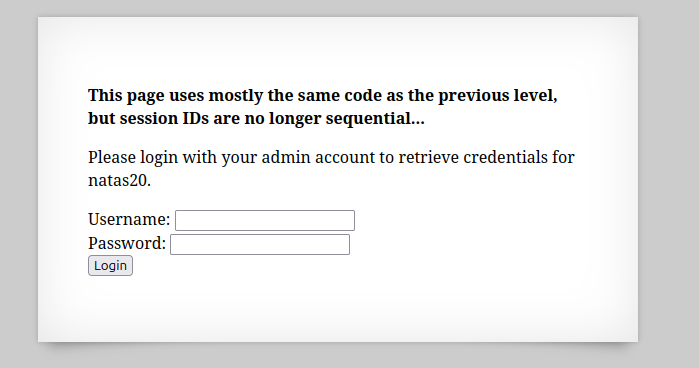
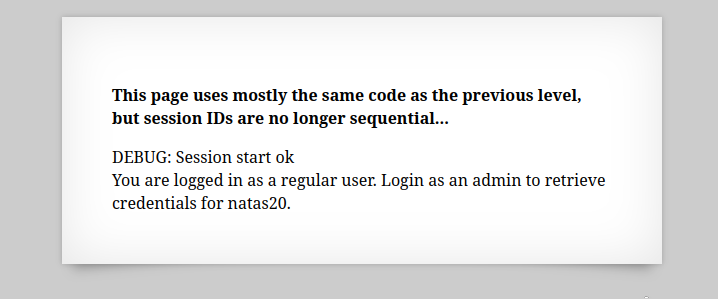
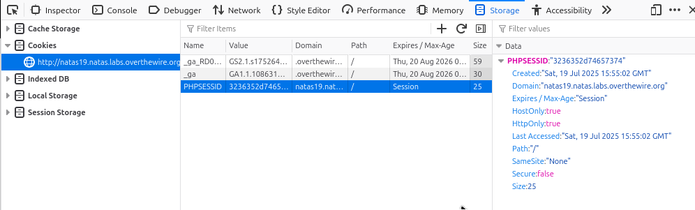
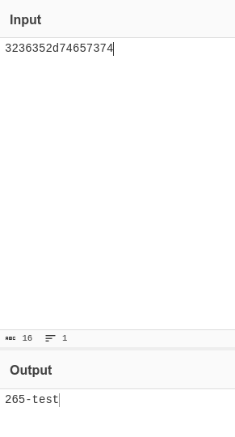

  

前の問題(natas18）のphpコードと似ているが今度はセッションIDが連続ではないらしい。  

適当に"test/test"でログインしてみる。  
またURLのクエリパラメータに"debug"をつけてリクエストを行う。  

  

開発者ツールからCookieを確認してみる。  

  

PHPSESSIDが`3236352d74657374`とある。  
16進数ぽいのでdecodeを行ってみると、  

  

`3236352d74657374`が`265-test`となった。  

前回の問題ではセッションIDが
