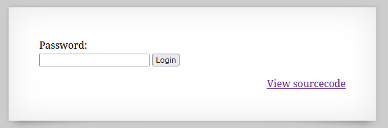
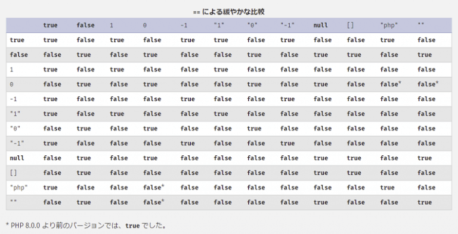

  

今回も正しいpasswordを入力する問題  

ソースコードを見てみる。  

```
 <html>
<head>
<!-- This stuff in the header has nothing to do with the level -->
<link rel="stylesheet" type="text/css" href="http://natas.labs.overthewire.org/css/level.css">
<link rel="stylesheet" href="http://natas.labs.overthewire.org/css/jquery-ui.css" />
<link rel="stylesheet" href="http://natas.labs.overthewire.org/css/wechall.css" />
<script src="http://natas.labs.overthewire.org/js/jquery-1.9.1.js"></script>
<script src="http://natas.labs.overthewire.org/js/jquery-ui.js"></script>
<script src="http://natas.labs.overthewire.org/js/wechall-data.js"></script><script src="http://natas.labs.overthewire.org/js/wechall.js"></script>
<script>var wechallinfo = { "level": "natas24", "pass": "<censored>" };</script></head>
<body>
<h1>natas24</h1>
<div id="content">

Password:
<form name="input" method="get">
    <input type="text" name="passwd" size=20>
    <input type="submit" value="Login">
</form>

<?php
    if(array_key_exists("passwd",$_REQUEST)){
        if(!strcmp($_REQUEST["passwd"],"<censored>")){
            echo "<br>The credentials for the next level are:<br>";
            echo "<pre>Username: natas25 Password: <censored></pre>";
        }
        else{
            echo "<br>Wrong!<br>";
        }
    }
    // morla / 10111
?>  
<div id="viewsource"><a href="index-source.html">View sourcecode</a></div>
</div>
</body>
</html>
```

注目する行はここ  
```
if(!strcmp($_REQUEST["passwd"],"<censored>"))
```

passwdパラメータで送られてきた文字列と何かを比較しているが消されている。  

比較はstrcmp()関数が使われており`strcmp(string $string1, string $string2)`の場合、  
string1がstring2よりも小さければ-1を、string1がstring2よりも大きければ1を、等しければ0を返すというもの。  

これは知識問題であり、"strcmp bypass"みたいな感じで調べるとbypass方法が出てくる。  

strcmp()は空の配列を指定されるとNULLを返し、NULL == 0はtrueを返すようになっている。  

  

つまり`/?passwd[]=hoge`のようにするとflagが得られる。  

