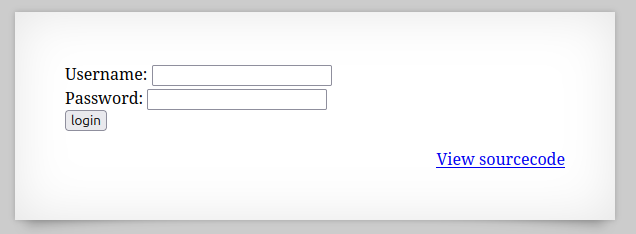
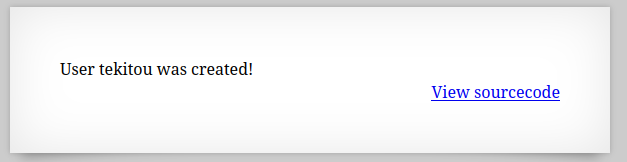
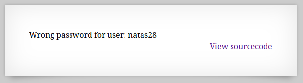
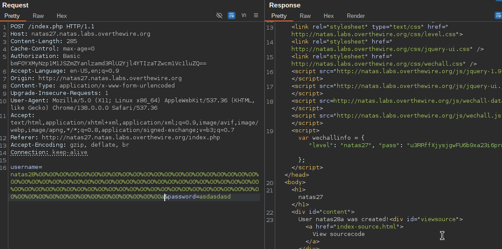
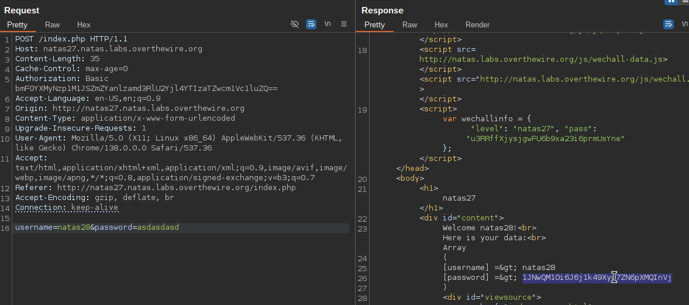

  

UsernameとPasswordを入力してログインを行うシステムらしい。  

適当に"tekitou/tekitou"を入力する。  

  

ユーザー"tekitou"が作成された。  

早速ソースコードを見る。  

```
<html>
<head>
<!-- This stuff in the header has nothing to do with the level -->
<link rel="stylesheet" type="text/css" href="http://natas.labs.overthewire.org/css/level.css">
<link rel="stylesheet" href="http://natas.labs.overthewire.org/css/jquery-ui.css" />
<link rel="stylesheet" href="http://natas.labs.overthewire.org/css/wechall.css" />
<script src="http://natas.labs.overthewire.org/js/jquery-1.9.1.js"></script>
<script src="http://natas.labs.overthewire.org/js/jquery-ui.js"></script>
<script src=http://natas.labs.overthewire.org/js/wechall-data.js></script><script src="http://natas.labs.overthewire.org/js/wechall.js"></script>
<script>var wechallinfo = { "level": "natas27", "pass": "<censored>" };</script></head>
<body>
<h1>natas27</h1>
<div id="content">
<?php

// morla / 10111
// database gets cleared every 5 min


/*
CREATE TABLE `users` (
  `username` varchar(64) DEFAULT NULL,
  `password` varchar(64) DEFAULT NULL
);
*/


function checkCredentials($link,$usr,$pass){

    $user=mysqli_real_escape_string($link, $usr);
    $password=mysqli_real_escape_string($link, $pass);

    $query = "SELECT username from users where username='$user' and password='$password' ";
    $res = mysqli_query($link, $query);
    if(mysqli_num_rows($res) > 0){
        return True;
    }
    return False;
}


function validUser($link,$usr){

    $user=mysqli_real_escape_string($link, $usr);

    $query = "SELECT * from users where username='$user'";
    $res = mysqli_query($link, $query);
    if($res) {
        if(mysqli_num_rows($res) > 0) {
            return True;
        }
    }
    return False;
}


function dumpData($link,$usr){

    $user=mysqli_real_escape_string($link, trim($usr));

    $query = "SELECT * from users where username='$user'";
    $res = mysqli_query($link, $query);
    if($res) {
        if(mysqli_num_rows($res) > 0) {
            while ($row = mysqli_fetch_assoc($res)) {
                // thanks to Gobo for reporting this bug!
                //return print_r($row);
                return print_r($row,true);
            }
        }
    }
    return False;
}


function createUser($link, $usr, $pass){

    if($usr != trim($usr)) {
        echo "Go away hacker";
        return False;
    }
    $user=mysqli_real_escape_string($link, substr($usr, 0, 64));
    $password=mysqli_real_escape_string($link, substr($pass, 0, 64));

    $query = "INSERT INTO users (username,password) values ('$user','$password')";
    $res = mysqli_query($link, $query);
    if(mysqli_affected_rows($link) > 0){
        return True;
    }
    return False;
}


if(array_key_exists("username", $_REQUEST) and array_key_exists("password", $_REQUEST)) {
    $link = mysqli_connect('localhost', 'natas27', '<censored>');
    mysqli_select_db($link, 'natas27');


    if(validUser($link,$_REQUEST["username"])) {
        //user exists, check creds
        if(checkCredentials($link,$_REQUEST["username"],$_REQUEST["password"])){
            echo "Welcome " . htmlentities($_REQUEST["username"]) . "!<br>";
            echo "Here is your data:<br>";
            $data=dumpData($link,$_REQUEST["username"]);
            print htmlentities($data);
        }
        else{
            echo "Wrong password for user: " . htmlentities($_REQUEST["username"]) . "<br>";
        }
    }
    else {
        //user doesn't exist
        if(createUser($link,$_REQUEST["username"],$_REQUEST["password"])){
            echo "User " . htmlentities($_REQUEST["username"]) . " was created!";
        }
    }

    mysqli_close($link);
} else {
?>

<form action="index.php" method="POST">
Username: <input name="username"><br>
Password: <input name="password" type="password"><br>
<input type="submit" value="login" />
</form>
<?php } ?>
<div id="viewsource"><a href="index-source.html">View sourcecode</a></div>
</div>
</body>
</html>
```

SQL文があるからDBへの攻撃かな？  


コードを読み解いていくと、  
全てのSQLクエリの前にmysqli_real_escape_string()関数で特殊文字がエスケープされているらしい。  


気になるコードはこちら  
```
if(array_key_exists("username", $_REQUEST) and array_key_exists("password", $_REQUEST)) {
    $link = mysqli_connect('localhost', 'natas27', '<censored>');
    mysqli_select_db($link, 'natas27');


    if(validUser($link,$_REQUEST["username"])) {
        //user exists, check creds
        if(checkCredentials($link,$_REQUEST["username"],$_REQUEST["password"])){
            echo "Welcome " . htmlentities($_REQUEST["username"]) . "!<br>";
            echo "Here is your data:<br>";
            $data=dumpData($link,$_REQUEST["username"]);
            print htmlentities($data);
        }
        else{
            echo "Wrong password for user: " . htmlentities($_REQUEST["username"]) . "<br>";
        }
    }
    else {
        //user doesn't exist
        if(createUser($link,$_REQUEST["username"],$_REQUEST["password"])){
            echo "User " . htmlentities($_REQUEST["username"]) . " was created!";
        }
    }

    mysqli_close($link);
} else {
```

`if(validUser($link,$_REQUEST["username"])) {`でDB内から有効なユーザー名を検索して有効であれば、  
`if(checkCredentials($link,$_REQUEST["username"],$_REQUEST["password"])){`でパスワードがあってるか確認し、  
ユーザー名と該当するDBのdumpデータを送ってくれるらしい。  
おそらくここにflagが入ってると予想する。  


まずは有効なユーザー名を探す。  

"natas28"ユーザーが存在するらしい。  
  


以下のコードで、新規ユーザーが登録される場合substr()関数で64文字以降は捨てられる。  
```
    $user=mysqli_real_escape_string($link, substr($usr, 0, 64));
```

つまり、  
`'natas28' + (64-len('natas28'))*NULL + <適当な文字>' `を登録したらnatas28のユーザー名の後に空白が埋められたユーザー名が登録される。  
最後に<適当な文字>を入れる理由はコード中の`trim($usr)`でユーザー名の最後が空白で終わっていたら"Go away hacker"と言われるからである。  

新規ユーザーを登録する場合最初のvalidUser関数で`mysqli_query()`を行うとき、64文字以上の文字列が送られた場合エラーが発生する。  
しかし処理が続行されるのでDBが Strict SQL Mode であるとわかる。  
Strictモードだと警告だけ発生し処理は続行される。  


空白が埋められたnatas28ユーザーを登録し、パスワードは適当に設定し登録を行う。  

  


64文字以降は切り捨てられたnatas28ユーザーが登録されたのでログインを行ってみると...  

  


クリア！  
