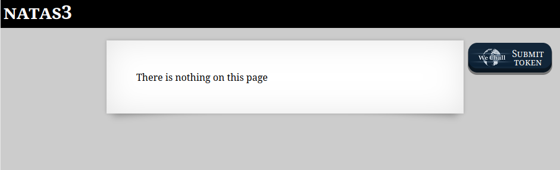
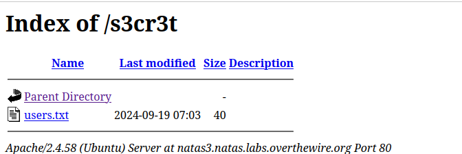

```

Natas Level 2 → Level 3

Username: natas3
URL:      http://natas3.natas.labs.overthewire.org

```



ソースコードを見る。  
```
<html>
<head>
<!-- This stuff in the header has nothing to do with the level -->
<link rel="stylesheet" type="text/css" href="http://natas.labs.overthewire.org/css/level.css">
<link rel="stylesheet" href="http://natas.labs.overthewire.org/css/jquery-ui.css" />
<link rel="stylesheet" href="http://natas.labs.overthewire.org/css/wechall.css" />
<script src="http://natas.labs.overthewire.org/js/jquery-1.9.1.js"></script>
<script src="http://natas.labs.overthewire.org/js/jquery-ui.js"></script>
<script src=http://natas.labs.overthewire.org/js/wechall-data.js></script><script src="http://natas.labs.overthewire.org/js/wechall.js"></script>
<script>var wechallinfo = { "level": "natas3", "pass": "3gqisGdR0pjm6tpkDKdIWO2hSvchLeYH" };</script></head>
<body>
<h1>natas3</h1>
<div id="content">
There is nothing on this page
<!-- No more information leaks!! Not even Google will find it this time... -->
</div>
</body></html>
```

今回はソースコードには書いてないようだ。  

"Not even Google will find it this time..."とあることからGoogleと関連のあるファイル`robots.txt`を見てみる。  

```
User-agent: *
Disallow: /s3cr3t/
```

`/s3cr3t/`を見る。  

  


users.txtに資格情報が書かれておりクリア。  

