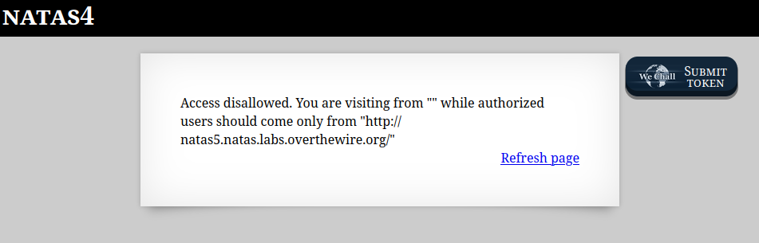

```

Natas Level 3 → Level 4

Username: natas4
URL:      http://natas4.natas.labs.overthewire.org

```

  

"http://natas5.natas.labs.overthewire.org/"からのアクセスでないとダメらしい。  

`Referer`ヘッダを使う。  

Refererヘッダとは  
> Referer ヘッダーにより、サーバーは人々がどこから訪問しに来たかを識別し、分析、ログ、キャッシュの最適化などに利用することができる

