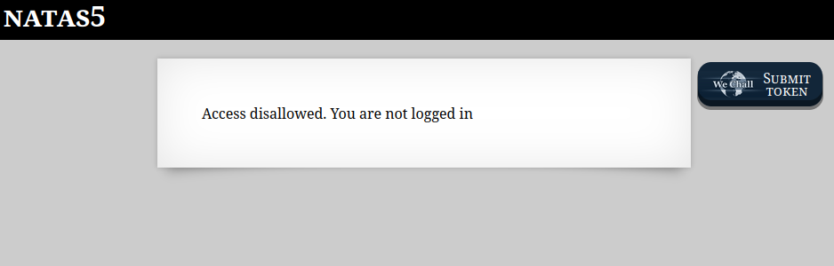
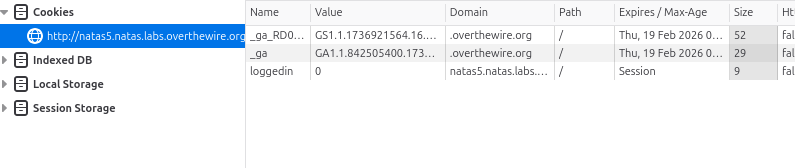

```

Natas Level 5 → Level 6

Username: natas6
URL:      http://natas6.natas.labs.overthewire.org

```

  

とのことなのでCookieを見てみる。  

  

`loggedin`の値が0なので1にリロード。  

ソースコード表示  
```
<html>
<head>
<!-- This stuff in the header has nothing to do with the level -->
<link rel="stylesheet" type="text/css" href="http://natas.labs.overthewire.org/css/level.css">
<link rel="stylesheet" href="http://natas.labs.overthewire.org/css/jquery-ui.css" />
<link rel="stylesheet" href="http://natas.labs.overthewire.org/css/wechall.css" />
<script src="http://natas.labs.overthewire.org/js/jquery-1.9.1.js"></script>
<script src="http://natas.labs.overthewire.org/js/jquery-ui.js"></script>
<script src=http://natas.labs.overthewire.org/js/wechall-data.js></script><script src="http://natas.labs.overthewire.org/js/wechall.js"></script>
<script>var wechallinfo = { "level": "natas5", "pass": "0n35PkggAPm2zbEpOU802c0x0Msn1ToK" };</script></head>
<body>
<h1>natas5</h1>
<div id="content">
Access granted. The password for natas6 is *******************************
</div>
</body>
</html>
```

クリア
