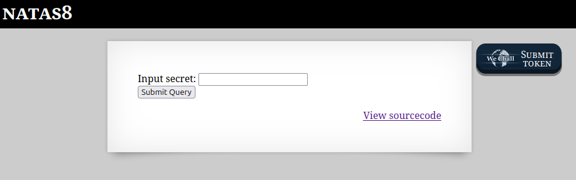
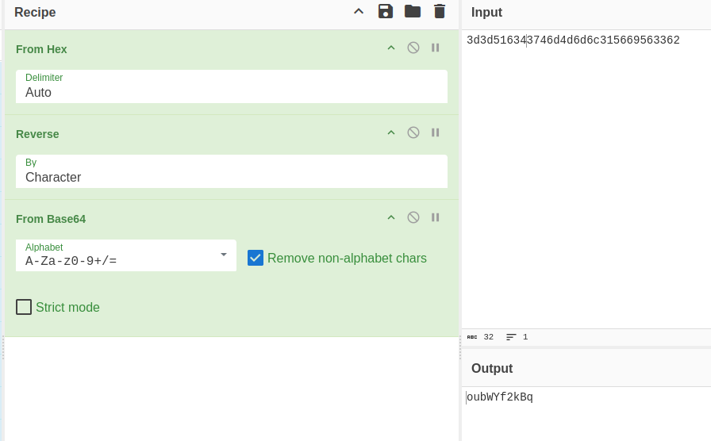

```
Natas Level 7 → Level 8

Username: natas8
URL:      http://natas8.natas.labs.overthewire.org

```

  

デジャヴ。  

ソースコードを見てみる。  

```
<html>
<head>
<!-- This stuff in the header has nothing to do with the level -->
<link rel="stylesheet" type="text/css" href="http://natas.labs.overthewire.org/css/level.css">
<link rel="stylesheet" href="http://natas.labs.overthewire.org/css/jquery-ui.css" />
<link rel="stylesheet" href="http://natas.labs.overthewire.org/css/wechall.css" />
<script src="http://natas.labs.overthewire.org/js/jquery-1.9.1.js"></script>
<script src="http://natas.labs.overthewire.org/js/jquery-ui.js"></script>
<script src=http://natas.labs.overthewire.org/js/wechall-data.js></script><script src="http://natas.labs.overthewire.org/js/wechall.js"></script>
<script>var wechallinfo = { "level": "natas8", "pass": "<censored>" };</script></head>
<body>
<h1>natas8</h1>
<div id="content">

<?

$encodedSecret = "3d3d516343746d4d6d6c315669563362";

function encodeSecret($secret) {
    return bin2hex(strrev(base64_encode($secret)));
}

if(array_key_exists("submit", $_POST)) {
    if(encodeSecret($_POST['secret']) == $encodedSecret) {
    print "Access granted. The password for natas9 is <censored>";
    } else {
    print "Wrong secret";
    }
}
?>

<form method=post>
Input secret: <input name=secret><br>
<input type=submit name=submit>
</form>

<div id="viewsource"><a href="index-source.html">View sourcecode</a></div>
</div>
</body>
</html>
```

`encodedSecret`に代入されているのは`3d3d516343746d4d6d6c315669563362`で、base64でencodeした後に`strrev()`関数で文字列にの前後を逆にし、  
16進数に変換した値であることがわかる。  
逆のことを行う。  

  

入力後のソースコード。  

```
<html>
<head>
<!-- This stuff in the header has nothing to do with the level -->
<link rel="stylesheet" type="text/css" href="http://natas.labs.overthewire.org/css/level.css">
<link rel="stylesheet" href="http://natas.labs.overthewire.org/css/jquery-ui.css" />
<link rel="stylesheet" href="http://natas.labs.overthewire.org/css/wechall.css" />
<script src="http://natas.labs.overthewire.org/js/jquery-1.9.1.js"></script>
<script src="http://natas.labs.overthewire.org/js/jquery-ui.js"></script>
<script src=http://natas.labs.overthewire.org/js/wechall-data.js></script><script src="http://natas.labs.overthewire.org/js/wechall.js"></script>
<script>var wechallinfo = { "level": "natas8", "pass": "xcoXLmzMkoIP9D7hlgPlh9XD7OgLAe5Q" };</script></head>
<body>
<h1>natas8</h1>
<div id="content">

Access granted. The password for natas9 is ****************************
<form method=post>
Input secret: <input name=secret><br>
<input type=submit name=submit>
</form>

<div id="viewsource"><a href="index-source.html">View sourcecode</a></div>
</div>
</body>
</html>
```

クリア
