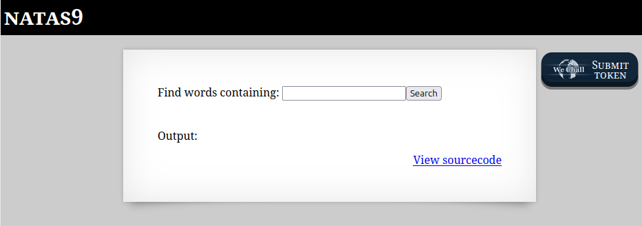
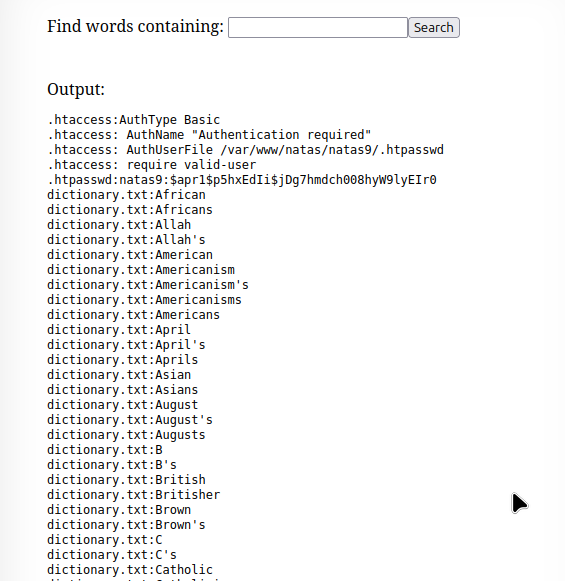

```

Natas Level 8 → Level 9

Username: natas9
URL:      http://natas9.natas.labs.overthewire.org

```

  

適当に`hoge`でSearchしてみる。  

```
http://natas9.natas.labs.overthewire.org/?needle=hoge&submit=Search
```

何も変化なく上記のパラメータが発行された。  

ソースコードを見られるので見てみる。  

```
 <html>
<head>
<!-- This stuff in the header has nothing to do with the level -->
<link rel="stylesheet" type="text/css" href="http://natas.labs.overthewire.org/css/level.css">
<link rel="stylesheet" href="http://natas.labs.overthewire.org/css/jquery-ui.css" />
<link rel="stylesheet" href="http://natas.labs.overthewire.org/css/wechall.css" />
<script src="http://natas.labs.overthewire.org/js/jquery-1.9.1.js"></script>
<script src="http://natas.labs.overthewire.org/js/jquery-ui.js"></script>
<script src=http://natas.labs.overthewire.org/js/wechall-data.js></script><script src="http://natas.labs.overthewire.org/js/wechall.js"></script>
<script>var wechallinfo = { "level": "natas9", "pass": "<censored>" };</script></head>
<body>
<h1>natas9</h1>
<div id="content">
<form>
Find words containing: <input name=needle><input type=submit name=submit value=Search><br><br>
</form>


Output:
<pre>
<?
$key = "";

if(array_key_exists("needle", $_REQUEST)) {
    $key = $_REQUEST["needle"];
}

if($key != "") {
    passthru("grep -i $key dictionary.txt");
}
?>
</pre>

<div id="viewsource"><a href="index-source.html">View sourcecode</a></div>
</div>
</body>
</html>
```

`needle`パラメータで送った文字列が`key`に入って、`key`がgrepコマンドの検索パターンとして使用されている。  

正規表現で任意の文字列を検索する「.*」をやってみる。  

  


色々表示された。  

